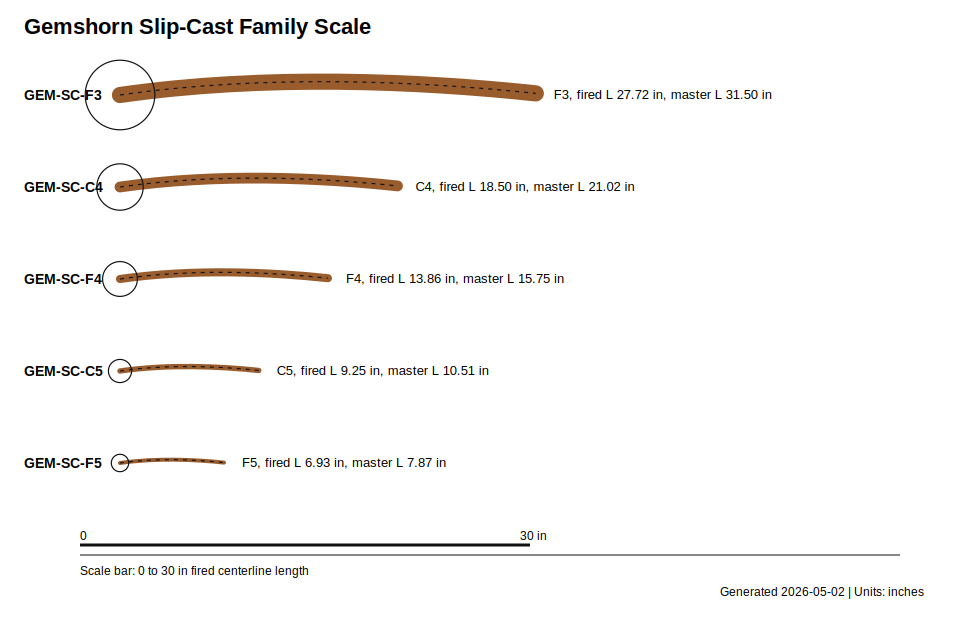

# Gemshorn

Generated/refreshed: 2026-05-06

This repo is the build documentation for an authentic/historically informed gemshorn and a modern slip-cast gemshorn consort. A gemshorn is a closed horn-shaped vessel flute: the pointed end is sealed, the wide end carries the fipple/block and voicing window, and pitch is governed primarily by chamber volume, window/vent conductance, and opened tone-hole area.

The repo deliberately separates the strict historical path from modern production paths. Natural horn is the authenticity reference; slip-cast ceramic is the repeatable family path; CNC-routed split wood is a modern prototype path for quick iteration and teaching.

## Status

**Status:** L2 V5 build-packet candidate

Current status: V5 explorer readiness packet on top of a v4 build packet baseline.
Fabrication authority remains measurement-gated: `gemshorn-design-table.xlsx`,
`family-spec.csv`, `cad/*.scad`, and the reviewed shop drawings are planning
authority only until fired shrinkage, water-fill volume, fipple response, leak
tests, and tuner results are logged in `validation.csv`.

Generated previews, site renders, print-packet images, and SVG review plates do
not create fabrication authority by themselves. See
`visual-output-register.csv` for the authority chain.

## Quick Start

1. Read `design.md`, `build-methods.md`, and `authenticity-notes.md`.
2. Open `gemshorn-design-table.xlsx` and replace shrinkage with your clay test-bar value.
3. Build the CNC-routed wood `GEM-SC-C5` if you want the fastest fipple/tuning test.
4. Build the slip-cast ceramic `GEM-SC-C5` to validate shrinkage and mold workflow.
5. Build the natural-horn `GEM-HIST-G4` to establish the authentic reference voice.
6. Update `validation.csv` after each prototype before scaling the full family.

## Build Methods

| Method | Purpose | Main Files |
| --- | --- | --- |
| Natural horn | Most historically conservative build path | `authentic-horn-build-plan.md`, `horn-blank-spec.csv`, `hole-schedule-historical.csv` |
| Slip-cast ceramic | Repeatable production family | `mold-and-slip-casting-plan.md`, `family-spec.csv`, `hole-schedule-modern.csv` |
| CNC-routed split wood | Modern fast prototype / teaching body | `cnc/wood-body-cnc-plan.md`, `cad/gemshorn_split_wood_body.scad`, `drawings/gemshorn-cnc-wood-body.svg` |
| Alternate materials | Research and prototyping candidates | `material-options.md`, `risks.md`, `validation.csv` |

## File Map

| File | Purpose |
| --- | --- |
| design.md | Project intent, acoustic model, assumptions, and file map. |
| build-methods.md | Real horn, slip-cast ceramic, CNC wood, and research-material build paths. |
| material-options.md | Candidate body/block/finish materials and safety gates. |
| authenticity-notes.md | Historical/provenance notes and source links. |
| authentic-horn-build-plan.md | Natural-horn authentic build workflow. |
| horn-blank-spec.csv | Horn blank buying/selection requirements. |
| gemshorn-design-table.xlsx | Parametric spreadsheet with formulas. |
| family-spec.csv | Size family dimensions. |
| hole-schedule-modern.csv | Modern consort hole schedule. |
| hole-schedule-historical.csv | Historically informed pilot hole schedule. |
| mold-and-slip-casting-plan.md | Master, mold, and casting workflow. |
| assembly-manual.md | Shop sequence from casting to final tuning. |
| risks.md | Red-team risk register with tests and mitigations. |
| photo-shotlist.md | Required photos for the v4 build-log site and future deck refreshes. |
| drawings/ | SVG drawings, visual BOM plate, and CNC wood-body drawing. |
| cad/ | OpenSCAD master-shape starters for ceramic and split-wood paths. |
| cnc/ | CNC operation plan, setup sheet, operations table, and wood-body CNC notes. |
| images/ | Placeholder folder and naming rules for future real build photos. |
| data/ | Material-test matrix and future measured-data tables. |
| evolution/ | Stage 0 evolution-pipeline intake (master manifest, design-intent, revisions). Gate A not yet run. |
| wolfram-starter.wl | Lightweight physics starter. |
| wolfram/gemshorn-wolfram-model.wl | v4.2 Wolfram model package. |
| site/index.html | Static build-log site. |
| print-packet.html / print-packet.pdf | Shop packet for browser or print use. |
| capstone-deck.md / capstone-deck.pptx | Capstone orientation deck. |

## First Build Recommendation

Start with a wood or ceramic `GEM-SC-C5` because it is small enough to make quickly and large enough to work by hand. After that, make `GEM-HIST-G4` in real horn to test the historically informed four-hole path. Expand to bass/tenor only after measured shrinkage, volume, leak, and tuning corrections are in `validation.csv`.

## v4 Deliverable Status

- Parametric design: `gemshorn-design-table.xlsx`
- Build methods: `build-methods.md`
- BOM/sourcing/cut/validation: `bom.csv`, `sourcing.csv`, `cut-list.csv`, `validation.csv`
- Drawings: `drawings/*.svg`
- CNC plan: `cnc/cnc-plan.json`, `cnc/operations.csv`, `cnc/setup-sheet.md`
- Wolfram package: `wolfram/gemshorn-wolfram-model.wl`
- Risks: `risks.md`
- Photo pipeline: `photo-shotlist.md`
- Build-log site: `site/index.html`
- Capstone and print packet: `capstone-deck.*`, `print-packet.*`
