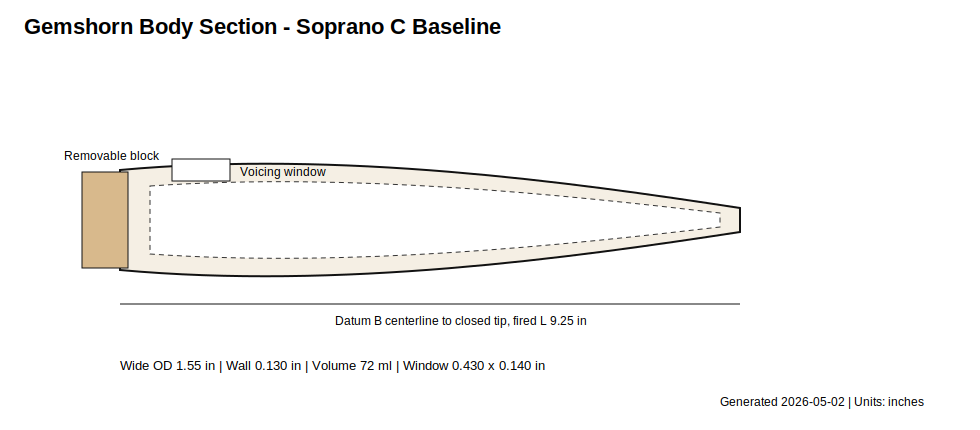
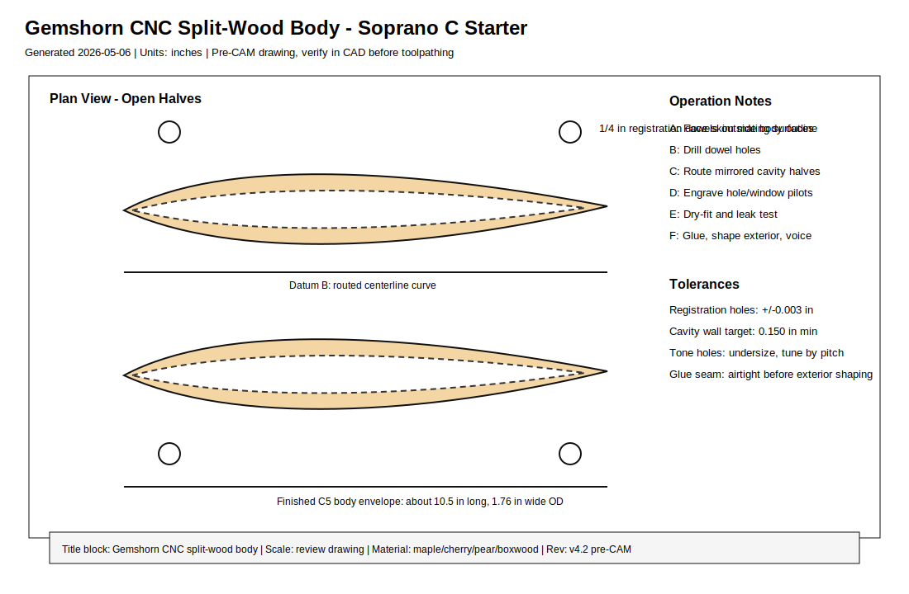
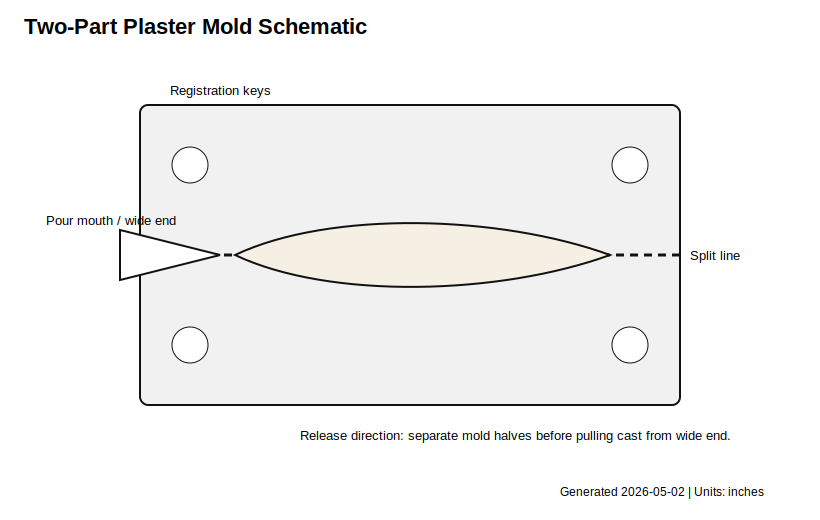

# Gemshorn Build Methods And Slip-Cast Family
- Musical instrument documentation capstone
- Build packet: gemshorn
- Generated: 2026-05-06

---

# Project Intent
- Generated: 2026-05-02
v4 refresh: 2026-05-06

_Speaker notes:_ Read design.md before committing to dimensions or sourcing decisions.

---

# Physics Model
- The working model is a Helmholtz/vessel-flute model, not an open-open flute model:

```
f = c/(2*pi) * sqrt(G_total / V)
G_total = sum(A_i / L_eff_i)
L_eff circular hole approx wall + 0.85*r
```

```
r = (0.85*G + sqrt((0.85*G)^2 + 4*pi*G*wall)) / (2*pi)
```

_Speaker notes:_ Governing equations extracted verbatim from design.md. Apply empirical corrections (NAF K2, scale offsets) only where the model permits — see references/acoustic-models.md.

---

# Hardware Alignment

| Operation | Tool / Fixture | Applies To | Release Check |
| --- | --- | --- | --- |
| Horn blank fitting | Fine saw, scraper, drill press, tapered reamers | Natural horn | Tip remains closed; fipple block seats without leaks. |
| Mold master shaping | 3D print, CNC tooling board, or sealed master | Slip-cast ceramic | Master is scaled by measured shrinkage and releases from plaster. |
| Plaster mold making | Two-part mold box, registration keys, pour mouth | Slip-cast ceramic | Mold halves register and cast releases at leather hard. |
| Split-wood CNC routing | 1/4 in upcut, 1/4 in ball end, 1/8 in ball end, dowel-pin fixture | CNC wood body | Halves register, cavity leak test passes before shaping. |
| Hole tuning | Pin gauges, drill bits, tapered reamers, wax | All methods | Holes start undersize and tune low to high. |
| Validation | Tuner, thermometer, water-fill volume setup, calipers | All methods | `validation.csv` records measured values, cents error, and action. |

_Speaker notes:_ Identifies which shop pipeline(s) this instrument lives in: Bambu+kiln slip-cast, 40W laser flat-pack, CNC+lathe, segmented turning, drum-skin work, or hybrid combinations.

---

# How To Use This Packet
- Start with design.md for intent and assumptions.
- Use bom.csv, sourcing.csv, and cut-list.csv before buying or cutting.
- Use drawing-brief.md and CAD/CNC folders before machining.
- Print the packet for shopping, shop work, and validation.

---

# File Map
- design.md: Project intent, catalog metadata, assumptions, and validation plan.
- bom.csv: Starter bill of materials with part categories, quantities, drawing refs, and notes.
- sourcing.csv: Supplier/search tracker with specs, price/date fields, lead time, substitutes, and risks.
- cut-list.csv: Rough/final stock sizes, material, grain/orientation, operations, yield, and offcuts.
- drawing-brief.md: Manufacturing drawing and technical product sketch brief.
- assembly-manual.md: Shop-facing sequence, tools, fixtures, safety, tuning, finishing, and maintenance notes.
- validation.csv: Target/measured values, tolerance, environment, result, and tuning/build action log.
- supplier-rfq.md: Supplier email/request-for-quote starter.

---

# Family Spec

| id | name | key | midi | freq_hz | scale | line | fired_centerline_length_in | master_centerline_length_in | fired_wide_od_in | master_wide_od_in | fired_tip_od_in | fired_wall_in | fired_wide_id_in | fired_tip_id_in | fired_internal_volume_in3 | fired_internal_volume_ml | window_width_in | window_height_in | windway_height_in | labium_setback_in | playing_support |
| --- | --- | --- | --- | --- | --- | --- | --- | --- | --- | --- | --- | --- | --- | --- | --- | --- | --- | --- | --- | --- | --- |
| GEM-SC-F3 | Bass F | F3 | 53 | 174.6141 | 2.9966 | modern slip-cast consort | 27.7187 | 31.4985 | 4.6448 | 5.2781 | 1.0788 | 0.24 | 4.1648 | 0.5988 | 146.5677 | 2401.8139 | 1.2885 | 0.4195 | 0.0589 | 1.2885 | bench, lap, or simple sling; large horn |
| GEM-SC-C4 | Tenor C | C4 | 60 | 261.6256 | 2.0 | modern slip-cast consort | 18.5 | 21.0227 | 3.1 | 3.5227 | 0.72 | 0.204 | 2.692 | 0.312 | 39.6387 | 649.5624 | 0.86 | 0.28 | 0.0481 | 0.86 | two-hand standing or seated |
| GEM-SC-F4 | Alto F | F4 | 65 | 349.2282 | 1.4983 | modern slip-cast consort | 13.8593 | 15.7493 | 2.3224 | 2.6391 | 0.5394 | 0.1691 | 1.9842 | 0.2012 | 15.8811 | 260.245 | 0.6443 | 0.2098 | 0.0416 | 0.6443 | comfortable hand instrument |
| GEM-SC-C5 | Soprano C | C5 | 72 | 523.2511 | 1.0 | modern slip-cast consort baseline | 9.25 | 10.5114 | 1.55 | 1.7614 | 0.36 | 0.13 | 1.29 | 0.1 | 4.3665 | 71.5536 | 0.43 | 0.14 | 0.034 | 0.43 | primary pilot size |
| GEM-SC-F5 | Sopranino F | F5 | 77 | 698.4565 | 0.7492 | modern slip-cast consort | 6.9297 | 7.8746 | 1.1612 | 1.3195 | 0.2697 | 0.11 | 0.9412 | 0.0497 | 1.6964 | 27.799 | 0.3221 | 0.1049 | 0.0294 | 0.3221 | small hand instrument; hole accuracy is critical |
| GEM-HIST-G4 | Historical Clay/Horn Archetype | G4 | 67 | 391.9954 | 1.3348 | historically informed 4 front plus thumb study | 12.3473 | 14.031 | 2.069 | 2.3511 | 0.4805 | 0.1568 | 1.7553 | 0.1669 | 10.9964 | 180.1994 | 0.574 | 0.1869 | 0.0393 | 0.574 | small hand instrument; exact historical pitch is not known |

_Speaker notes:_ Sizes scale via the master scale factor; tuning targets are first-order Helmholtz/cantilever predictions to be empirically corrected per prototype.

---

# Build Workflow
- Design and assumptions
- Source materials and hardware
- Prepare stock, fixtures, and CNC/laser/lathe setup
- Assemble, tune, finish, and validate

---

# Sourcing And BOM
- BOM gives part categories and drawing references.
- Sourcing tracks search terms, supplier candidates, price/date, lead time, substitutions.
- Visual BOM brief turns the parts list into a presentation-ready image board.

---

# Shop Packet
- Cut list for lumber/sheet/blank planning.
- Assembly manual for away-from-keyboard work.
- Validation sheet for measured dimensions, tuning, pass/fail checks.

---

# Drawings, CAD, CNC
- drawing-brief.md defines required views, dimensions, datums, sketch intent.
- cad/ holds models and design tables.
- cnc/ holds CAM, toolpaths, setup sheets, dry-run notes.
- drawings/ holds PDFs, SVGs, DXFs, drawing exports.






---

# Images And Screenshots
- Add hero render/photo, visual BOM, shop screenshots, drawing previews, validation photos in images/.

---

# Validation Plan
- A4 = 440 Hz reference check.
- Tuning targets logged in validation.csv.
- Critical dimensions verified against design sheet and CAD.
- Photos and revision notes after each major step.

---

# Open Risks / Decisions
- TBDs in design sheet and BOM.
- Supplier price/availability not yet verified.
- Generated images marked as concept placeholders.
- Empirical corrections await measured prototype data.

---

# Next Actions
- Replace TBDs with measured/source-backed values.
- Verify live supplier price and availability before buying.
- Export final drawings and visual BOM images.
- Regenerate this deck and print packet after final edits.

---
